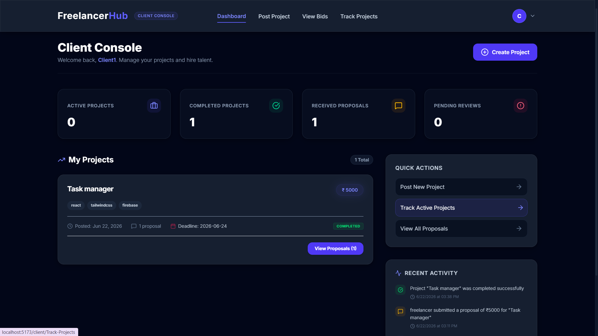
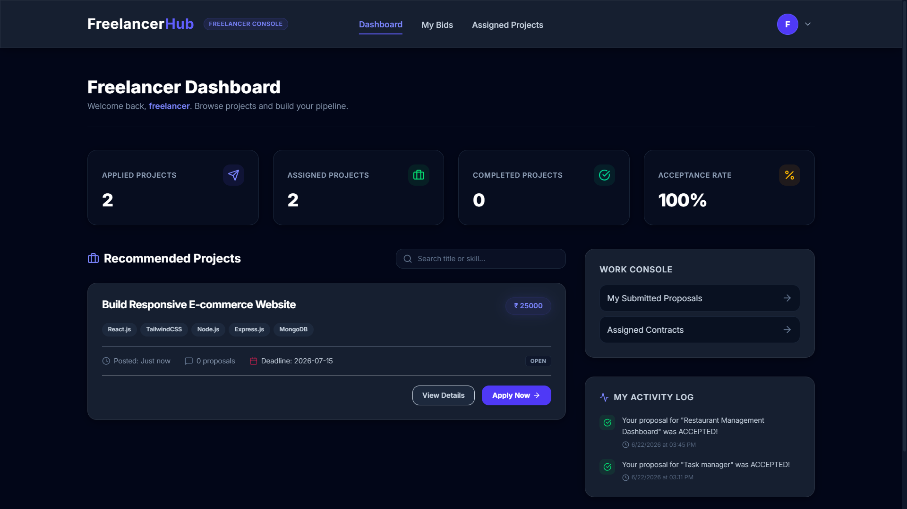

# 🚀 FreelancerHub

A modern role-based freelance marketplace built with React, Firebase Authentication, Firestore, and Tailwind CSS.

FreelancerHub connects clients and freelancers on a single platform where clients can post projects, freelancers can submit proposals, and both parties can manage project workflows in real time.

---

## 📌 Features

### Client Features

* Create and manage projects
* View all posted projects
* Receive freelancer proposals
* Review submitted bids
* Accept freelancers for projects
* Track project progress

### Freelancer Features

* Browse available projects
* Search projects by title
* Submit proposals and bids
* View submitted proposals
* Track assigned projects
* Monitor proposal status

### Platform Features

* Firebase Authentication
* Role-based access control
* Real-time Firestore updates
* Protected routes
* Responsive UI
* Dashboard analytics
* Project assignment workflow

---

## 🛠️ Tech Stack

### Frontend

* React.js
* Vite
* React Router
* Tailwind CSS

### Backend & Database

* Firebase Authentication
* Firebase Firestore

### State Management

* React Context API

### Notifications

* React Hot Toast

---

## 🏗️ System Architecture

Client Application (React)
↓
Firebase Authentication
↓
Firestore Database
↓
Collections:

* users
* projects
* bids

---

## 📂 Database Structure

### Users Collection

```js
{
  uid,
  username,
  email,
  role
}
```

### Projects Collection

```js
{
  title,
  description,
  budget,
  skills,
  deadline,
  clientId,
  clientName,
  proposalCount,
  status,
  assignedFreelancerId,
  createdAt
}
```

### Bids Collection

```js
{
  projectId,
  projectTitle,
  freelancerId,
  freelancerName,
  clientId,
  bidAmount,
  proposalTime,
  proposal,
  status,
  createdAt
}
```

---

## 🔄 User Flow

### Client Flow

1. Register/Login as Client
2. Create Project
3. Receive Proposals
4. Review Bids
5. Accept Freelancer
6. Track Project Progress

### Freelancer Flow

1. Register/Login as Freelancer
2. Browse Projects
3. Submit Proposal
4. Wait for Approval
5. Get Assigned Project
6. Complete Work

---

## 🔐 Authentication & Authorization

* Firebase Authentication handles signup and login.
* User roles are stored in Firestore.
* Protected routes restrict access based on authentication.
* Role-based dashboards provide different functionality for Clients and Freelancers.

---

## ⚡ Real-Time Features

The application uses Firestore's `onSnapshot()` listener to provide:

* Real-time project updates
* Instant proposal updates
* Live dashboard statistics
* Automatic UI synchronization

No page refresh is required when data changes.

---

## 📸 Screenshots

Add screenshots after deployment:

### Landing Page


### Client Dashboard



### Freelancer Dashboard



---

## 🚀 Live Demo

Add after deployment:

```text
https://your-app.vercel.app
```

---

## ⚙️ Installation

Clone the repository:

```bash
git clone https://github.com/abhirajsinh27/Freelancer-Hub.git
```

Navigate into the project:

```bash
cd Freelancer-Hub
```

Install dependencies:

```bash
npm install
```

Run locally:

```bash
npm run dev
```

---

## 🎯 Future Improvements

* In-app messaging system
* File upload support
* Project milestones
* Payment integration
* Notifications system
* Admin dashboard
* Freelancer ratings & reviews

---

## 👨‍💻 Author

**Abhirajsinh Vala**

B.Tech Computer Engineering
Indus University

GitHub:
https://github.com/abhirajsinh27

---

## 📄 License

This project is licensed under the MIT License.
